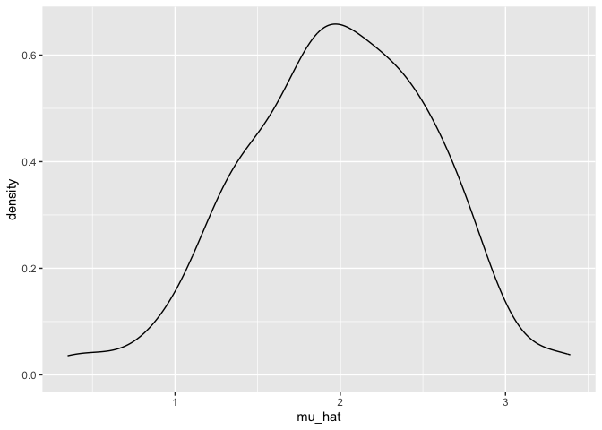
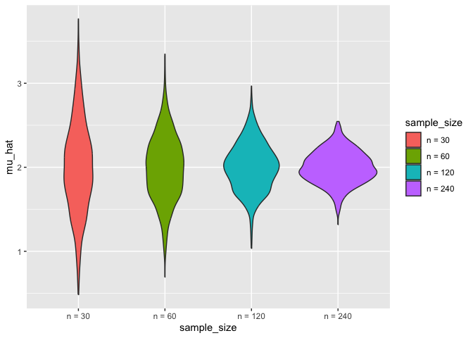
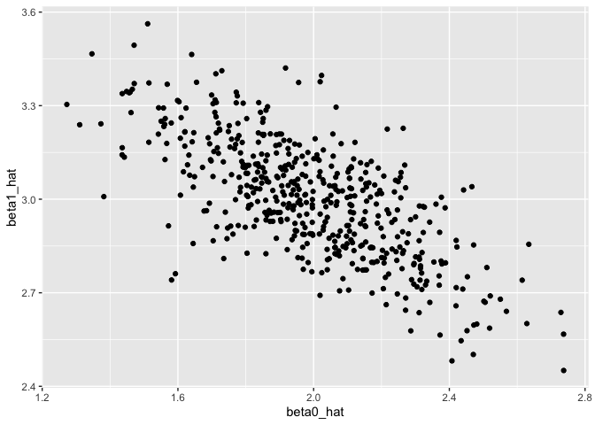
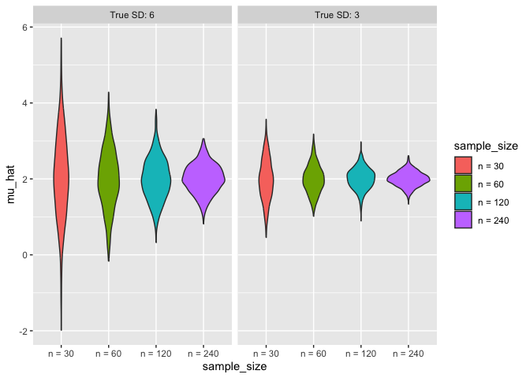

Simulations
================

``` r
library(tidyverse)
```

    ## ── Attaching core tidyverse packages ──────────────────────── tidyverse 2.0.0 ──
    ## ✔ dplyr     1.1.4     ✔ readr     2.1.5
    ## ✔ forcats   1.0.0     ✔ stringr   1.5.1
    ## ✔ ggplot2   3.5.2     ✔ tibble    3.3.0
    ## ✔ lubridate 1.9.4     ✔ tidyr     1.3.1
    ## ✔ purrr     1.1.0     
    ## ── Conflicts ────────────────────────────────────────── tidyverse_conflicts() ──
    ## ✖ dplyr::filter() masks stats::filter()
    ## ✖ dplyr::lag()    masks stats::lag()
    ## ℹ Use the conflicted package (<http://conflicted.r-lib.org/>) to force all conflicts to become errors

``` r
library(rvest)
```

    ## 
    ## Attaching package: 'rvest'
    ## 
    ## The following object is masked from 'package:readr':
    ## 
    ##     guess_encoding

``` r
set.seed(1)
```

## Mean and SD for one n

``` r
sim_mean_sd = function(n, mu = 2, sigma = 3) {
  
  sim_data = tibble(
    x = rnorm(n, mean = mu, sd = sigma),
  )
  
  sim_data |> 
    summarize(
      mu_hat = mean(x),
      sigma_hat = sd(x)
    )
}
```

let’s run it a 100 times “simulate” with a `for` loop

``` r
output = vector("list", 100)

for (i in 1:100) {
  output[[i]] = sim_mean_sd(30)
}

sim_results = bind_rows(output)
```

``` r
sim_results_df = 
  expand_grid(
    sample_size = 30,
    iter = 1:100
  ) |> 
  mutate(
    estimate_df = map(sample_size, sim_mean_sd)
  ) |> 
  unnest(estimate_df)
```

``` r
sim_results_df |> 
  ggplot(aes(x = mu_hat)) + 
  geom_density()
```

<!-- -->

``` r
sim_results_df |> 
  pivot_longer(
    mu_hat:sigma_hat,
    names_to = "parameter", 
    values_to = "estimate") |> 
  group_by(parameter) |> 
  summarize(
    emp_mean = mean(estimate),
    emp_sd = sd(estimate)) |> 
  knitr::kable(digits = 3)
```

| parameter | emp_mean | emp_sd |
|:----------|---------:|-------:|
| mu_hat    |    1.985 |  0.567 |
| sigma_hat |    2.979 |  0.384 |

## Several N’s

``` r
sim_results_df =   
  map(1:100, \(i) sim_mean_sd(30, 2, 3)) |> 
  bind_rows()
```

``` r
sim_results_df = 
  expand_grid(
    sample_size = c(30, 60, 120, 240),
    iter = 1:1000
  ) |> 
  mutate(
    estimate_df = map(sample_size, sim_mean_sd)
  ) |> 
  unnest(estimate_df)
```

Instead of fixing the sample size, you’re varying it systematically.

You can now compare how estimator variability changes as sample size
increases.

This shows an important principle: larger n → smaller variance of the
estimator.

## Plots

``` r
sim_results_df |> 
  mutate(
    sample_size = str_c("n = ", sample_size),
    sample_size = fct_inorder(sample_size)) |> 
  ggplot(aes(x = sample_size, y = mu_hat, fill = sample_size)) + 
  geom_violin()
```

<!-- -->

Empiral mean and variance of estimates

``` r
sim_results_df |> 
  pivot_longer(
    mu_hat:sigma_hat,
    names_to = "parameter", 
    values_to = "estimate") |> 
  group_by(parameter, sample_size) |> 
  summarize(
    emp_mean = mean(estimate),
    emp_var = var(estimate)) |> 
  knitr::kable(digits = 3)
```

    ## `summarise()` has grouped output by 'parameter'. You can override using the
    ## `.groups` argument.

| parameter | sample_size | emp_mean | emp_var |
|:----------|------------:|---------:|--------:|
| mu_hat    |          30 |    2.001 |   0.289 |
| mu_hat    |          60 |    1.992 |   0.147 |
| mu_hat    |         120 |    2.005 |   0.079 |
| mu_hat    |         240 |    1.999 |   0.038 |
| sigma_hat |          30 |    2.974 |   0.154 |
| sigma_hat |          60 |    2.999 |   0.068 |
| sigma_hat |         120 |    2.996 |   0.039 |
| sigma_hat |         240 |    2.994 |   0.018 |

## Regression

``` r
sim_regression = function(n, beta0 = 2, beta1 = 3) {
  
  sim_data = 
    tibble(
      x = rnorm(n, mean = 1, sd = 1),
      y = beta0 + beta1 * x + rnorm(n, 0, 1)
    )
  
  ls_fit = lm(y ~ x, data = sim_data)
  
  tibble(
    beta0_hat = coef(ls_fit)[1],
    beta1_hat = coef(ls_fit)[2]
  )
}
```

``` r
sim_results_df = 
  expand_grid(
    sample_size = 30,
    iter = 1:500
  ) |> 
  mutate(
    estimate_df = map(sample_size, sim_regression)
  ) |> 
  unnest(estimate_df)
```

``` r
sim_results_df |> 
  ggplot(aes(x = beta0_hat, y = beta1_hat)) + 
  geom_point()
```

<!-- -->

## two parameters

sd and sample size

``` r
sim_results_df = 
  expand_grid(
    sample_size = c(30, 60, 120, 240),
    true_sd = c(6, 3),
    iter = 1:1000
  ) |> 
  mutate(
    estimate_df = 
      map2(sample_size, true_sd, \(n, sd) sim_mean_sd(n = n, sigma = sd))
  ) |> 
  unnest(estimate_df)
```

``` r
sim_results_df |> 
  mutate(
    true_sd = str_c("True SD: ", true_sd),
    true_sd = fct_inorder(true_sd),
    sample_size = str_c("n = ", sample_size),
    sample_size = fct_inorder(sample_size)) |> 
  ggplot(aes(x = sample_size, y = mu_hat, fill = sample_size)) + 
  geom_violin() + 
  facet_grid(. ~ true_sd)
```

<!-- -->
