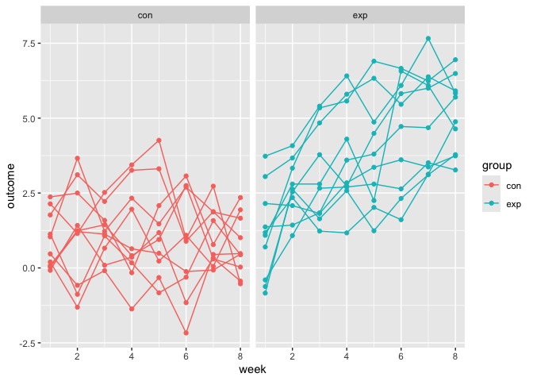

Iterations and Listcols
================

``` r
library(tidyverse)
```

    ## ── Attaching core tidyverse packages ──────────────────────── tidyverse 2.0.0 ──
    ## ✔ dplyr     1.1.4     ✔ readr     2.1.5
    ## ✔ forcats   1.0.0     ✔ stringr   1.5.1
    ## ✔ ggplot2   3.5.2     ✔ tibble    3.3.0
    ## ✔ lubridate 1.9.4     ✔ tidyr     1.3.1
    ## ✔ purrr     1.1.0     
    ## ── Conflicts ────────────────────────────────────────── tidyverse_conflicts() ──
    ## ✖ dplyr::filter() masks stats::filter()
    ## ✖ dplyr::lag()    masks stats::lag()
    ## ℹ Use the conflicted package (<http://conflicted.r-lib.org/>) to force all conflicts to become errors

``` r
library(rvest)
```

    ## 
    ## Attaching package: 'rvest'
    ## 
    ## The following object is masked from 'package:readr':
    ## 
    ##     guess_encoding

``` r
set.seed(1)
```

## Lists

You can put anything into lists

``` r
vec_numeric = 5:8
vec_char = c("My", "name", "is", "Jeff")
vec_logical = c(TRUE, TRUE, TRUE, FALSE)
```

``` r
l = list(
  vec_numeric = 5:8,
  mat         = matrix(1:8, 2, 4),
  vec_logical = c(TRUE, FALSE),
  summary     = summary(rnorm(1000)))
l
```

    ## $vec_numeric
    ## [1] 5 6 7 8
    ## 
    ## $mat
    ##      [,1] [,2] [,3] [,4]
    ## [1,]    1    3    5    7
    ## [2,]    2    4    6    8
    ## 
    ## $vec_logical
    ## [1]  TRUE FALSE
    ## 
    ## $summary
    ##     Min.  1st Qu.   Median     Mean  3rd Qu.     Max. 
    ## -3.00805 -0.69737 -0.03532 -0.01165  0.68843  3.81028

``` r
l$vec_numeric
```

    ## [1] 5 6 7 8

``` r
l[[1]]
```

    ## [1] 5 6 7 8

``` r
l[[1]][1:3]
```

    ## [1] 5 6 7

Lists can be accessed using names/indices

## `for` loops

``` r
list_norms = 
  list(
    a = rnorm(20, 3, 1),
    b = rnorm(20, 0, 5),
    c = rnorm(20, 10, .2),
    d = rnorm(20, -3, 1)
  )

is.list(list_norms)
```

    ## [1] TRUE

apply function to each element of the list

``` r
mean_and_sd = function(x) {
  
  if (!is.numeric(x)) {
    stop("Argument x should be numeric")
  } else if (length(x) == 1) {
    stop("Cannot be computed for length 1 vectors")
  }
  
  mean_x = mean(x)
  sd_x = sd(x)

  tibble(
    mean = mean_x, 
    sd = sd_x
  )
}

mean_and_sd(list_norms[[1]])
```

    ## # A tibble: 1 × 2
    ##    mean    sd
    ##   <dbl> <dbl>
    ## 1  2.70  1.12

``` r
mean_and_sd(list_norms[[2]])
```

    ## # A tibble: 1 × 2
    ##    mean    sd
    ##   <dbl> <dbl>
    ## 1 0.416  4.08

``` r
mean_and_sd(list_norms[[3]])
```

    ## # A tibble: 1 × 2
    ##    mean    sd
    ##   <dbl> <dbl>
    ## 1  10.1 0.191

``` r
mean_and_sd(list_norms[[4]])
```

    ## # A tibble: 1 × 2
    ##    mean    sd
    ##   <dbl> <dbl>
    ## 1 -3.43  1.18

Let’s use a for loop:

``` r
output = vector("list", length = 4)

for (i in 1:4) {
  output[[i]] = mean_and_sd(list_norms[[i]])
}
```

## Let’s try map!

``` r
output = map(list_norms, mean_and_sd)
```

## Map variants

``` r
output = map_dbl(list_norms, median, .id = "input")

output = map_dfr(list_norms, mean_and_sd, .id = "input")
```

## List columns

``` r
listcol_df = 
  tibble(
    name = c("a", "b", "c", "d"),
    samp = list_norms
  )

listcol_df |> pull(name)
```

    ## [1] "a" "b" "c" "d"

``` r
listcol_df |> pull(samp)
```

    ## $a
    ##  [1] 4.134965 4.111932 2.129222 3.210732 3.069396 1.337351 3.810840 1.087654
    ##  [9] 1.753247 3.998154 2.459127 2.783624 1.378063 1.549036 3.350910 2.825453
    ## [17] 2.408572 1.665973 1.902701 5.036104
    ## 
    ## $b
    ##  [1] -1.63244797  3.87002606  3.92503200  3.81623040  1.47404380 -6.26177962
    ##  [7] -5.04751876  3.75695597 -6.54176756  2.63770049 -2.66769787 -1.99188007
    ## [13] -3.94784725 -1.15070568  4.38592421  2.26866589 -1.16232074  4.35002762
    ## [19]  8.28001867 -0.03184464
    ## 
    ## $c
    ##  [1] 10.094098 10.055644  9.804419  9.814683 10.383954 10.176256 10.148416
    ##  [8] 10.029515 10.097078 10.030371 10.008400 10.044684  9.797907 10.480244
    ## [15] 10.160392  9.949758 10.242578  9.874548 10.342232  9.921125
    ## 
    ## $d
    ##  [1] -5.321491 -1.635881 -1.867771 -3.774316 -4.410375 -4.834528 -3.269014
    ##  [8] -4.833929 -3.814468 -2.836428 -2.144481 -3.819963 -3.123603 -2.745052
    ## [15] -1.281074 -3.958544 -4.604310 -4.845609 -2.444263 -3.060119

Let’s try some operations

``` r
mean_and_sd(pull(listcol_df, samp)[[1]])
```

    ## # A tibble: 1 × 2
    ##    mean    sd
    ##   <dbl> <dbl>
    ## 1  2.70  1.12

Can i just map instead of pulling each one sep?

``` r
map(pull(listcol_df, samp), mean_and_sd)
```

    ## $a
    ## # A tibble: 1 × 2
    ##    mean    sd
    ##   <dbl> <dbl>
    ## 1  2.70  1.12
    ## 
    ## $b
    ## # A tibble: 1 × 2
    ##    mean    sd
    ##   <dbl> <dbl>
    ## 1 0.416  4.08
    ## 
    ## $c
    ## # A tibble: 1 × 2
    ##    mean    sd
    ##   <dbl> <dbl>
    ## 1  10.1 0.191
    ## 
    ## $d
    ## # A tibble: 1 × 2
    ##    mean    sd
    ##   <dbl> <dbl>
    ## 1 -3.43  1.18

can we add a list column?

``` r
listcol_df = 
  listcol_df |> 
  mutate(summary = map(samp, mean_and_sd))

listcol_df
```

    ## # A tibble: 4 × 3
    ##   name  samp         summary         
    ##   <chr> <named list> <named list>    
    ## 1 a     <dbl [20]>   <tibble [1 × 2]>
    ## 2 b     <dbl [20]>   <tibble [1 × 2]>
    ## 3 c     <dbl [20]>   <tibble [1 × 2]>
    ## 4 d     <dbl [20]>   <tibble [1 × 2]>

## Nested Data

``` r
library(p8105.datasets)
data("weather_df")
```

``` r
weather_nest = 
  nest(weather_df, data = date:tmin)

weather_nest
```

    ## # A tibble: 3 × 3
    ##   name           id          data              
    ##   <chr>          <chr>       <list>            
    ## 1 CentralPark_NY USW00094728 <tibble [730 × 4]>
    ## 2 Molokai_HI     USW00022534 <tibble [730 × 4]>
    ## 3 Waterhole_WA   USS0023B17S <tibble [730 × 4]>

``` r
weather_nest |> pull(name)
```

    ## [1] "CentralPark_NY" "Molokai_HI"     "Waterhole_WA"

``` r
weather_nest |> pull(data)
```

    ## [[1]]
    ## # A tibble: 730 × 4
    ##    date        prcp  tmax  tmin
    ##    <date>     <dbl> <dbl> <dbl>
    ##  1 2021-01-01   157   4.4   0.6
    ##  2 2021-01-02    13  10.6   2.2
    ##  3 2021-01-03    56   3.3   1.1
    ##  4 2021-01-04     5   6.1   1.7
    ##  5 2021-01-05     0   5.6   2.2
    ##  6 2021-01-06     0   5     1.1
    ##  7 2021-01-07     0   5    -1  
    ##  8 2021-01-08     0   2.8  -2.7
    ##  9 2021-01-09     0   2.8  -4.3
    ## 10 2021-01-10     0   5    -1.6
    ## # ℹ 720 more rows
    ## 
    ## [[2]]
    ## # A tibble: 730 × 4
    ##    date        prcp  tmax  tmin
    ##    <date>     <dbl> <dbl> <dbl>
    ##  1 2021-01-01     0  27.8  22.2
    ##  2 2021-01-02     0  28.3  23.9
    ##  3 2021-01-03     0  28.3  23.3
    ##  4 2021-01-04     0  30    18.9
    ##  5 2021-01-05     0  28.9  21.7
    ##  6 2021-01-06     0  27.8  20  
    ##  7 2021-01-07     0  29.4  21.7
    ##  8 2021-01-08     0  28.3  18.3
    ##  9 2021-01-09     0  27.8  18.9
    ## 10 2021-01-10     0  28.3  18.9
    ## # ℹ 720 more rows
    ## 
    ## [[3]]
    ## # A tibble: 730 × 4
    ##    date        prcp  tmax  tmin
    ##    <date>     <dbl> <dbl> <dbl>
    ##  1 2021-01-01   254   3.2   0  
    ##  2 2021-01-02   152   0.9  -3.2
    ##  3 2021-01-03     0   0.2  -4.2
    ##  4 2021-01-04   559   0.9  -3.2
    ##  5 2021-01-05    25   0.5  -3.3
    ##  6 2021-01-06    51   0.8  -4.8
    ##  7 2021-01-07     0   0.2  -5.8
    ##  8 2021-01-08    25   0.5  -8.3
    ##  9 2021-01-09     0   0.1  -7.7
    ## 10 2021-01-10   203   0.9  -0.1
    ## # ℹ 720 more rows

## unnest

``` r
unnest(weather_nest, cols = data)
```

    ## # A tibble: 2,190 × 6
    ##    name           id          date        prcp  tmax  tmin
    ##    <chr>          <chr>       <date>     <dbl> <dbl> <dbl>
    ##  1 CentralPark_NY USW00094728 2021-01-01   157   4.4   0.6
    ##  2 CentralPark_NY USW00094728 2021-01-02    13  10.6   2.2
    ##  3 CentralPark_NY USW00094728 2021-01-03    56   3.3   1.1
    ##  4 CentralPark_NY USW00094728 2021-01-04     5   6.1   1.7
    ##  5 CentralPark_NY USW00094728 2021-01-05     0   5.6   2.2
    ##  6 CentralPark_NY USW00094728 2021-01-06     0   5     1.1
    ##  7 CentralPark_NY USW00094728 2021-01-07     0   5    -1  
    ##  8 CentralPark_NY USW00094728 2021-01-08     0   2.8  -2.7
    ##  9 CentralPark_NY USW00094728 2021-01-09     0   2.8  -4.3
    ## 10 CentralPark_NY USW00094728 2021-01-10     0   5    -1.6
    ## # ℹ 2,180 more rows

## linear reg

Suppose we want to fit the simple linear regression relating tmax to
tmin for each station-specific data frame.

``` r
weather_lm = function(df) {
  lm(tmax ~ tmin, data = df)
}

weather_lm(pull(weather_nest, data)[[1]])
```

    ## 
    ## Call:
    ## lm(formula = tmax ~ tmin, data = df)
    ## 
    ## Coefficients:
    ## (Intercept)         tmin  
    ##       7.514        1.034

``` r
map(pull(weather_nest, data), weather_lm)
```

    ## [[1]]
    ## 
    ## Call:
    ## lm(formula = tmax ~ tmin, data = df)
    ## 
    ## Coefficients:
    ## (Intercept)         tmin  
    ##       7.514        1.034  
    ## 
    ## 
    ## [[2]]
    ## 
    ## Call:
    ## lm(formula = tmax ~ tmin, data = df)
    ## 
    ## Coefficients:
    ## (Intercept)         tmin  
    ##     21.7547       0.3222  
    ## 
    ## 
    ## [[3]]
    ## 
    ## Call:
    ## lm(formula = tmax ~ tmin, data = df)
    ## 
    ## Coefficients:
    ## (Intercept)         tmin  
    ##       7.532        1.137

``` r
map(pull(weather_nest, data), \(df) lm(tmax ~ tmin, data = df))
```

    ## [[1]]
    ## 
    ## Call:
    ## lm(formula = tmax ~ tmin, data = df)
    ## 
    ## Coefficients:
    ## (Intercept)         tmin  
    ##       7.514        1.034  
    ## 
    ## 
    ## [[2]]
    ## 
    ## Call:
    ## lm(formula = tmax ~ tmin, data = df)
    ## 
    ## Coefficients:
    ## (Intercept)         tmin  
    ##     21.7547       0.3222  
    ## 
    ## 
    ## [[3]]
    ## 
    ## Call:
    ## lm(formula = tmax ~ tmin, data = df)
    ## 
    ## Coefficients:
    ## (Intercept)         tmin  
    ##       7.532        1.137

What about a map in a list column?

``` r
weather_nest = 
  weather_nest |> 
  mutate(models = map(data, weather_lm))

weather_nest
```

    ## # A tibble: 3 × 4
    ##   name           id          data               models
    ##   <chr>          <chr>       <list>             <list>
    ## 1 CentralPark_NY USW00094728 <tibble [730 × 4]> <lm>  
    ## 2 Molokai_HI     USW00022534 <tibble [730 × 4]> <lm>  
    ## 3 Waterhole_WA   USS0023B17S <tibble [730 × 4]> <lm>

## Iteration for data import

``` r
full_df = 
  tibble(
    files = list.files("data/exp_data/"),
    path = str_c("data/exp_data/", files)
  ) %>% 
  mutate(data = map(path, read_csv)) %>% 
  unnest()
```

    ## Rows: 1 Columns: 8
    ## ── Column specification ────────────────────────────────────────────────────────
    ## Delimiter: ","
    ## dbl (8): week_1, week_2, week_3, week_4, week_5, week_6, week_7, week_8
    ## 
    ## ℹ Use `spec()` to retrieve the full column specification for this data.
    ## ℹ Specify the column types or set `show_col_types = FALSE` to quiet this message.
    ## Rows: 1 Columns: 8
    ## ── Column specification ────────────────────────────────────────────────────────
    ## Delimiter: ","
    ## dbl (8): week_1, week_2, week_3, week_4, week_5, week_6, week_7, week_8
    ## 
    ## ℹ Use `spec()` to retrieve the full column specification for this data.
    ## ℹ Specify the column types or set `show_col_types = FALSE` to quiet this message.
    ## Rows: 1 Columns: 8
    ## ── Column specification ────────────────────────────────────────────────────────
    ## Delimiter: ","
    ## dbl (8): week_1, week_2, week_3, week_4, week_5, week_6, week_7, week_8
    ## 
    ## ℹ Use `spec()` to retrieve the full column specification for this data.
    ## ℹ Specify the column types or set `show_col_types = FALSE` to quiet this message.
    ## Rows: 1 Columns: 8
    ## ── Column specification ────────────────────────────────────────────────────────
    ## Delimiter: ","
    ## dbl (8): week_1, week_2, week_3, week_4, week_5, week_6, week_7, week_8
    ## 
    ## ℹ Use `spec()` to retrieve the full column specification for this data.
    ## ℹ Specify the column types or set `show_col_types = FALSE` to quiet this message.
    ## Rows: 1 Columns: 8
    ## ── Column specification ────────────────────────────────────────────────────────
    ## Delimiter: ","
    ## dbl (8): week_1, week_2, week_3, week_4, week_5, week_6, week_7, week_8
    ## 
    ## ℹ Use `spec()` to retrieve the full column specification for this data.
    ## ℹ Specify the column types or set `show_col_types = FALSE` to quiet this message.
    ## Rows: 1 Columns: 8
    ## ── Column specification ────────────────────────────────────────────────────────
    ## Delimiter: ","
    ## dbl (8): week_1, week_2, week_3, week_4, week_5, week_6, week_7, week_8
    ## 
    ## ℹ Use `spec()` to retrieve the full column specification for this data.
    ## ℹ Specify the column types or set `show_col_types = FALSE` to quiet this message.
    ## Rows: 1 Columns: 8
    ## ── Column specification ────────────────────────────────────────────────────────
    ## Delimiter: ","
    ## dbl (8): week_1, week_2, week_3, week_4, week_5, week_6, week_7, week_8
    ## 
    ## ℹ Use `spec()` to retrieve the full column specification for this data.
    ## ℹ Specify the column types or set `show_col_types = FALSE` to quiet this message.
    ## Rows: 1 Columns: 8
    ## ── Column specification ────────────────────────────────────────────────────────
    ## Delimiter: ","
    ## dbl (8): week_1, week_2, week_3, week_4, week_5, week_6, week_7, week_8
    ## 
    ## ℹ Use `spec()` to retrieve the full column specification for this data.
    ## ℹ Specify the column types or set `show_col_types = FALSE` to quiet this message.
    ## Rows: 1 Columns: 8
    ## ── Column specification ────────────────────────────────────────────────────────
    ## Delimiter: ","
    ## dbl (8): week_1, week_2, week_3, week_4, week_5, week_6, week_7, week_8
    ## 
    ## ℹ Use `spec()` to retrieve the full column specification for this data.
    ## ℹ Specify the column types or set `show_col_types = FALSE` to quiet this message.
    ## Rows: 1 Columns: 8
    ## ── Column specification ────────────────────────────────────────────────────────
    ## Delimiter: ","
    ## dbl (8): week_1, week_2, week_3, week_4, week_5, week_6, week_7, week_8
    ## 
    ## ℹ Use `spec()` to retrieve the full column specification for this data.
    ## ℹ Specify the column types or set `show_col_types = FALSE` to quiet this message.
    ## Rows: 1 Columns: 8
    ## ── Column specification ────────────────────────────────────────────────────────
    ## Delimiter: ","
    ## dbl (8): week_1, week_2, week_3, week_4, week_5, week_6, week_7, week_8
    ## 
    ## ℹ Use `spec()` to retrieve the full column specification for this data.
    ## ℹ Specify the column types or set `show_col_types = FALSE` to quiet this message.
    ## Rows: 1 Columns: 8
    ## ── Column specification ────────────────────────────────────────────────────────
    ## Delimiter: ","
    ## dbl (8): week_1, week_2, week_3, week_4, week_5, week_6, week_7, week_8
    ## 
    ## ℹ Use `spec()` to retrieve the full column specification for this data.
    ## ℹ Specify the column types or set `show_col_types = FALSE` to quiet this message.
    ## Rows: 1 Columns: 8
    ## ── Column specification ────────────────────────────────────────────────────────
    ## Delimiter: ","
    ## dbl (8): week_1, week_2, week_3, week_4, week_5, week_6, week_7, week_8
    ## 
    ## ℹ Use `spec()` to retrieve the full column specification for this data.
    ## ℹ Specify the column types or set `show_col_types = FALSE` to quiet this message.
    ## Rows: 1 Columns: 8
    ## ── Column specification ────────────────────────────────────────────────────────
    ## Delimiter: ","
    ## dbl (8): week_1, week_2, week_3, week_4, week_5, week_6, week_7, week_8
    ## 
    ## ℹ Use `spec()` to retrieve the full column specification for this data.
    ## ℹ Specify the column types or set `show_col_types = FALSE` to quiet this message.
    ## Rows: 1 Columns: 8
    ## ── Column specification ────────────────────────────────────────────────────────
    ## Delimiter: ","
    ## dbl (8): week_1, week_2, week_3, week_4, week_5, week_6, week_7, week_8
    ## 
    ## ℹ Use `spec()` to retrieve the full column specification for this data.
    ## ℹ Specify the column types or set `show_col_types = FALSE` to quiet this message.
    ## Rows: 1 Columns: 8
    ## ── Column specification ────────────────────────────────────────────────────────
    ## Delimiter: ","
    ## dbl (8): week_1, week_2, week_3, week_4, week_5, week_6, week_7, week_8
    ## 
    ## ℹ Use `spec()` to retrieve the full column specification for this data.
    ## ℹ Specify the column types or set `show_col_types = FALSE` to quiet this message.
    ## Rows: 1 Columns: 8
    ## ── Column specification ────────────────────────────────────────────────────────
    ## Delimiter: ","
    ## dbl (8): week_1, week_2, week_3, week_4, week_5, week_6, week_7, week_8
    ## 
    ## ℹ Use `spec()` to retrieve the full column specification for this data.
    ## ℹ Specify the column types or set `show_col_types = FALSE` to quiet this message.
    ## Rows: 1 Columns: 8
    ## ── Column specification ────────────────────────────────────────────────────────
    ## Delimiter: ","
    ## dbl (8): week_1, week_2, week_3, week_4, week_5, week_6, week_7, week_8
    ## 
    ## ℹ Use `spec()` to retrieve the full column specification for this data.
    ## ℹ Specify the column types or set `show_col_types = FALSE` to quiet this message.
    ## Rows: 1 Columns: 8
    ## ── Column specification ────────────────────────────────────────────────────────
    ## Delimiter: ","
    ## dbl (8): week_1, week_2, week_3, week_4, week_5, week_6, week_7, week_8
    ## 
    ## ℹ Use `spec()` to retrieve the full column specification for this data.
    ## ℹ Specify the column types or set `show_col_types = FALSE` to quiet this message.
    ## Rows: 1 Columns: 8
    ## ── Column specification ────────────────────────────────────────────────────────
    ## Delimiter: ","
    ## dbl (8): week_1, week_2, week_3, week_4, week_5, week_6, week_7, week_8
    ## 
    ## ℹ Use `spec()` to retrieve the full column specification for this data.
    ## ℹ Specify the column types or set `show_col_types = FALSE` to quiet this message.

    ## Warning: `cols` is now required when using `unnest()`.
    ## ℹ Please use `cols = c(data)`.

``` r
tidy_df = 
  full_df %>% 
  mutate(
    files = str_replace(files, ".csv", ""),
    group = str_sub(files, 1, 3)) %>% 
  pivot_longer(
    week_1:week_8,
    names_to = "week",
    values_to = "outcome",
    names_prefix = "week_") %>% 
  mutate(week = as.numeric(week)) %>% 
  select(group, subj = files, week, outcome)
```

``` r
tidy_df %>% 
  ggplot(aes(x = week, y = outcome, group = subj, color = group)) + 
  geom_point() + 
  geom_path() + 
  facet_grid(~group)
```

<!-- -->
